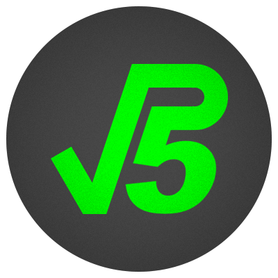
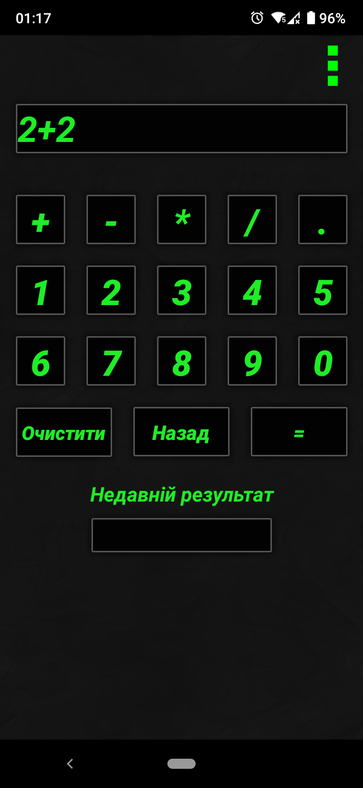
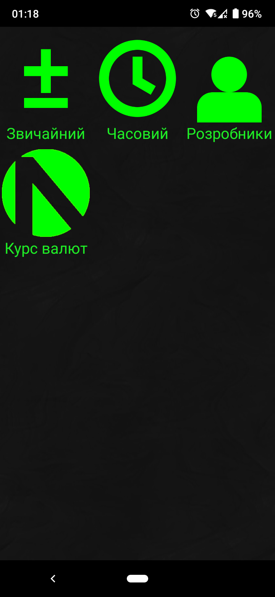
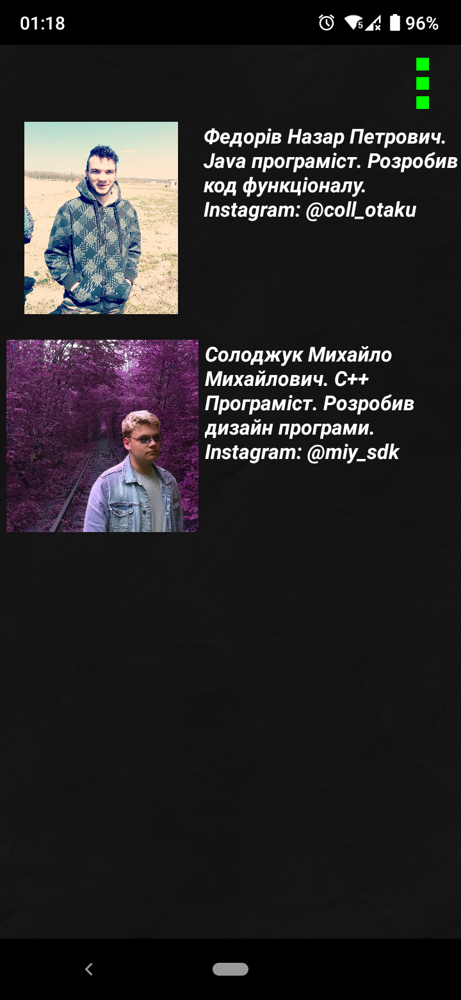

<p align="center"></p>
<h1 align="center">Coollyator</h1>

## Description
<b>EN:</b>

This is my second project created in **AndroidStudio (Java)**.

The project was created as an educational one. To create a simple calculator on **AndroidStudio**.

<b>UA:</b>

Це мій другий проект, створений в **AndroidStudio (Java)**.

Проект було створено як учбовий. Для створення простого калькулятора на **AndroidStudio**.

#
## Screenshots
<p>
  
  
  
  
</p>

#
## Technologies used
<b>EN:</b>
- Calculations of simple expressions
- Time calculations
- Using **WebView** to open links

<b>UA:</b>
- Обчислення простих виразів
- Розрахунок часу
- Використання **WebView** для відкриття посилань

#
## License
```
© 2020, CoolOtaku (ericspz531@gmail.com)
```
