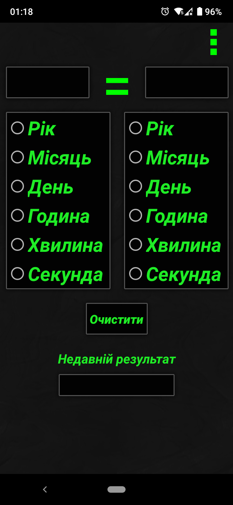

# Coollyator

<p align="center"></p>

## EN

This is my second project created in AndroidStudio (Java).

The project was created as an educational one. To create a simple calculator on **AndroidStudio**.

### Screenshots of the application:

<p>
  
  
  
  
</p>

## UA

Це мій другий проект, створений в AndroidStudio (Java).

Проект було створено як учбовий. Для створення простого калькулятора на **AndroidStudio**.

### Скріншоти додатка:

<p>
  
  
  
  
</p>

## Others

### License

```
© 2020, CoolOtaku (ericspz531@gmail.com)
```
